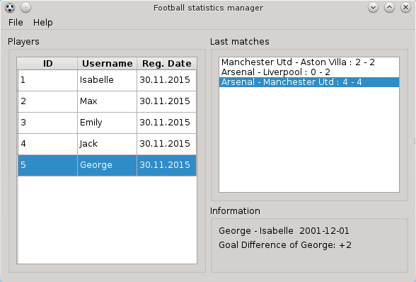
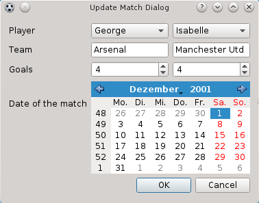
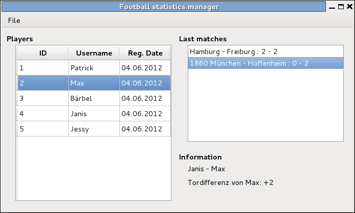

pyfootballmngr
==============

[]
(https://drone.io/github.com/MarkusHackspacher/pyfootballmngr/latest)
[]
(https://www.quantifiedcode.com/app/project/510d01cdfb734c9e96dd65912b38d130)

An alternative to paper-pencil method for recording results.

Is a fork from http://sourceforge.net/p/pyfootballmngr

install
-------

The program requires [Python 2.7 or 3.x](http://www.python.org/download/) 
and [Qt4 for Python](http://www.riverbankcomputing.com/software/pyqt/download)
or [Qt5 for Python](http://www.riverbankcomputing.com/software/pyqt/download5).

Start with:
```python pyfootballmngr.py```



translation
-----------

To translate the program or make a translation in your language,
insert in the complete.pro your language code.

```
cd modules
pylupdate5 complete.pro
```

translate your language file: pyfbm_xx.ts, and produce the .ts translation files to .qm with

```
lrelease complete.pro
```

fill free to add your language in complete.pro.



license: 
--------

GNU GPLv3



